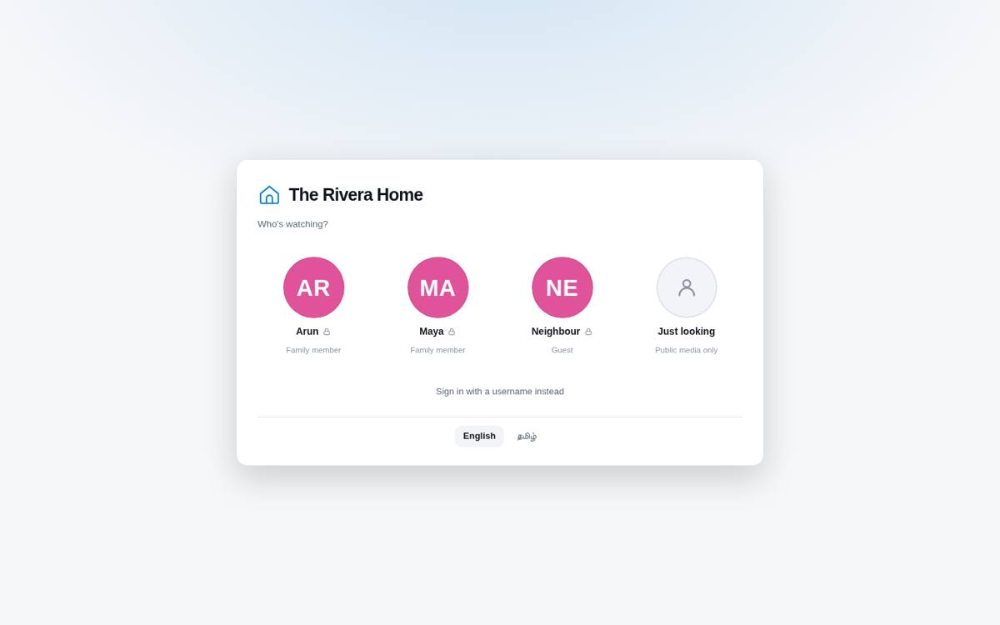
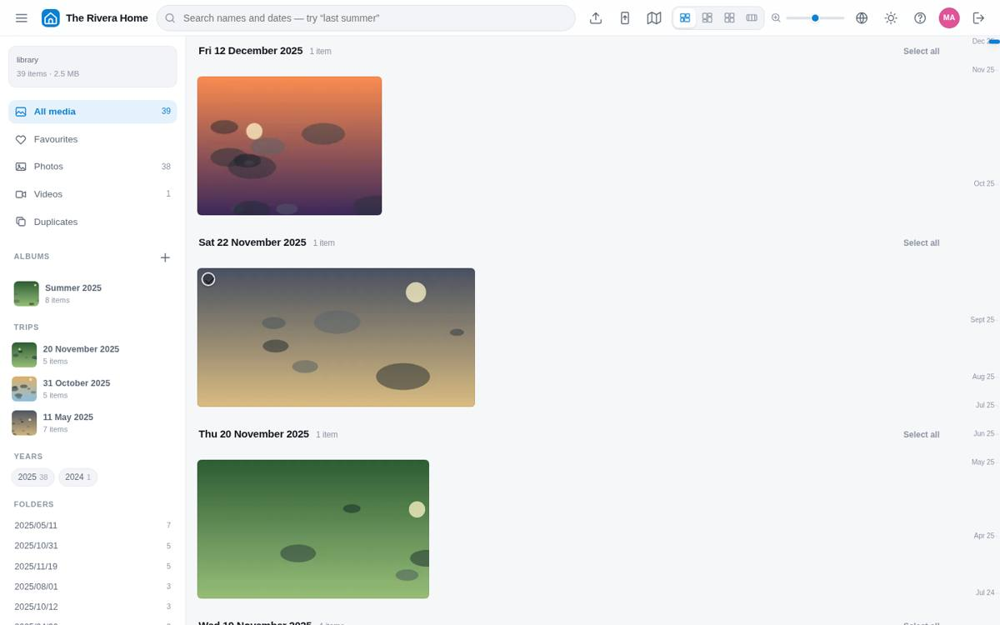
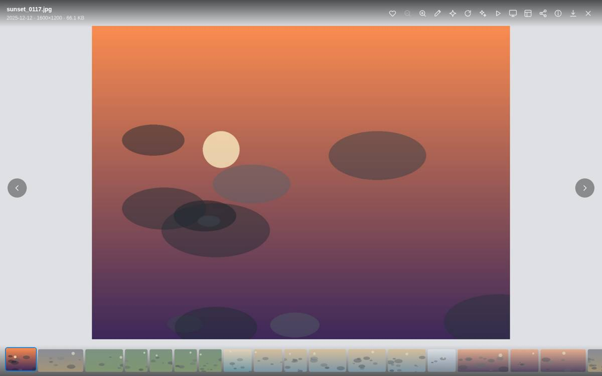
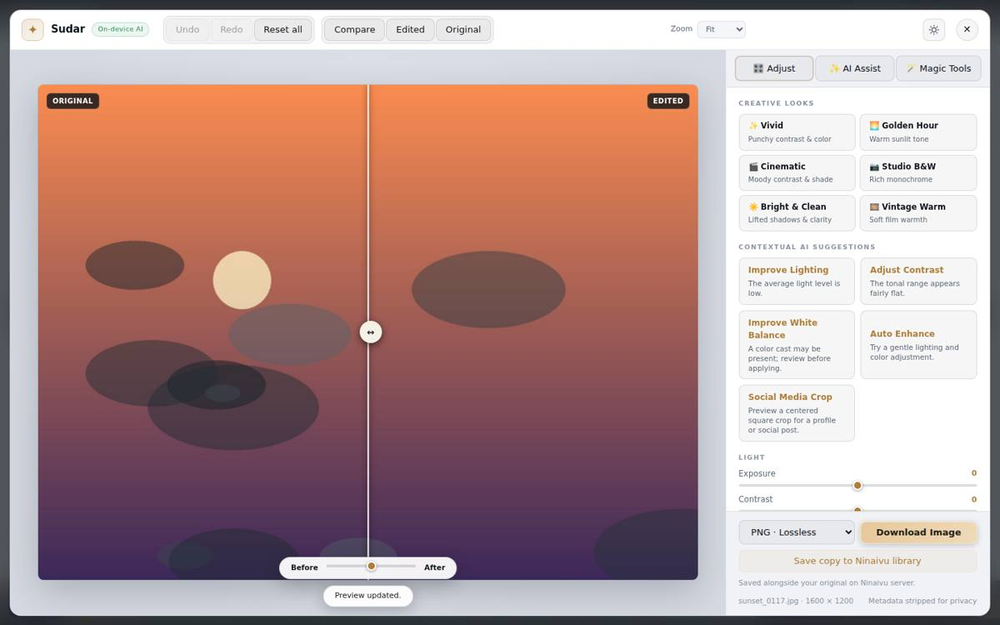

# The family app

Everything a family member or guest needs, and nothing else. You do not need
to know anything about servers to use Ninaivu: it opens like a website, and
on a phone or tablet you add it to the home screen once and it behaves like
an app.

Two things explain most of how it behaves:

- **Everything has a visibility.** Every photograph is *public*, *family* or
  *admins only*. What you see depends on which profile you came in as.
- **The management screens are somewhere else.** The administrator runs
  Ninaivu from a separate console on its own address. A family member or
  guest can change nothing about the library from the family app; an
  administrator signed in there can also delete and change visibility.

## Coming in

The family app opens on the household's profiles. Tap yours. What that costs
depends on how the administrator set it up:

| | |
| --- | --- |
| **Tap to enter** | nothing at all — right for the family tablet or a shared television |
| **PIN** | four to eight digits, shown as a small lock on your tile |
| **Password** | the full form, for guests and anyone who wants it |
| **Just looking** | with open browsing on, a tile that needs no profile and shows only what is public |

Administrators never appear on this picker; they sign in on the console. You
can change your own name, colour and picture whatever your role.

## The gallery

Everything you may see, newest first, grouped by day. Four layouts, and they
are a real preference: **justified** suits mixed shapes, **masonry** tall
photographs, **grid** scanning, **filmstrip** one long roll. `+` and `−`
change the thumbnail size; `T` switches the theme.

The left column is the library's shape: photos, videos, favourites,
duplicates the index found, albums, trips the dates suggest, then years and
folders. Click any of them and it becomes a removable filter chip; chips
stack, so *beach* + *2019* + a person is one click each. The strip down the
right edge jumps anywhere in the library by month, as smoothly on a hundred
thousand photographs as on a hundred.

**Search** takes plain words. On a Full machine ([AI](ai.md)) the image model
ranks results by how well the picture matches — "the beach at sunset" works
as written, nobody tagged anything. On a Basic machine search covers names,
dates, places, people and the words in file and folder names. The map button
shows every located photograph grouped by place.

**Selecting.** Click the circle on a tile, Shift-click for a range, `X` on
the focused tile, or ⌘/Ctrl+A for everything shown. With a selection you can
favourite, download or add to an album at once; an administrator also
changes visibility in bulk.

## A photograph

The whole photograph fitted to your screen, with its date, place and people,
and the actions your role may take.

- **Zoom** with the wheel or a pinch, drag to pan, double-click to zoom to a
  point; `0` puts it back. Arrow keys or a swipe move on.
- `I` — **details**: camera, lens, ISO, aperture, where the date came from,
  the location if the file carried one.
- `S` — **find similar**: up to twelve photographs that look like this one —
  the other attempts at the same moment. It needs search by description
  ([AI](ai.md)); without it the panel says the photograph is not analysed yet.
- `F` — **favourite**. Favourites are private to you, even when several
  people share the same folder. Guests cannot favourite.
- `R` — **rotate** (Shift for the other way). A turn saved by a family
  member is saved for the whole household; the file itself is not touched
  unless an administrator writes the turn into it.
- `D` — download the original (family members and administrators).
- **Share link** — a link for this photograph, with an optional password, that
  shows exactly what you could already see.
- **Edit photo** — Sudar, the photo studio, below.
- `Space` — a slideshow. `K` — the **Ambient Frame**: full screen, a slow
  drift across each picture, a clock in the corner, a new photograph every
  few seconds. It is the reason to keep an old tablet on the kitchen wall.
  `Esc` comes back.

Live Photos and motion photos play their short clip; Ninaivu pairs the still
and the video during indexing.

Press `?` anywhere for the full list of keys.

## People

If faces are on, a row of people appears in the sidebar. Click one to see
that person's photographs. The count is *yours* — how many you are allowed
to open — so two people in the house may see different numbers for the same
person. Naming people and confirming matches are the administrator's job on
the console; in the family app, People is read-only.

## Albums

Any family member can make an album and add to it. Albums hold references,
not copies: deleting an album never touches a photograph. An album can be
shared as a link, with an optional password.

## Sending photographs

Family members can upload from the gallery; the files wait for the
administrator under **Review → Uploads** before they join the library, and a
name that already exists gets a short suffix rather than overwriting
anything. On a phone added to the home screen, the backup screen sends the
photographs and videos you choose: keep the page open while it sends — a web
page cannot read the phone's library by itself or keep going in the
background — and it skips what is already here and resumes where it stopped.
The limit is 512 MB per upload. Guests cannot upload.

## Sudar, the photo studio

**Sudar** (சுடர், *glow*) edits a photograph in the browser: looks,
suggestions measured from the picture, light and colour sliders,
straightening and crops, with the original on the left and the edit on the
right. "Make it warmer" in plain words works too. The original file is never
changed; a copy can be saved beside it, and a family member's copy waits for
the administrator's approval like an upload.

With the Creative Studio extension on ([AI](ai.md)), Sudar also does
generative edits, object removal and upscaling — on this computer or on an
AI server at home. Nothing leaves the house.

## Language

The language button switches between English and Tamil (the sign-in and lock
screens have it too). It is saved on your profile, so every device you use
follows it.

## The screen lock

After 15 minutes without use, the app locks; your PIN or password opens it
again, and anything in progress carries on meanwhile.

## Sound recordings

Sound files in the library — voice notes, voicemail, dictation swept up from
old drives — are administrator-only, always. A photograph is looked at on
purpose; a recording plays out loud the moment somebody taps it, in a room
with other people in it.

## On a phone

Open the address the administrator gives you while on the home Wi-Fi, then
**Add to Home Screen**. It opens like an app and works offline for what it
has already shown. Away from home, it works only if the household set up
[remote access](remote-access.md).
